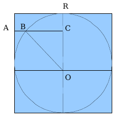

#LIF 1

##TP 1

Utilisez vos notes de TD afin de rédiger les programmes suivants :  
1. Faire un Hello World !  
2. Écrire un programme permettant de calculer la moyenne de 3 valeurs réelles  
3. Écrire un programme permettant d’afficher de la plus petite de deux valeurs  
4. Traduire en langage C l’exercice 6 du TD1. Programmer une calculatrice proposant les opérations classiques  
5. Saisie d’une valeur entre deux bornes  
6. Écrire un programme permettant d’afficher les tables de multiplication pour tous les entiers de 1 à 10.  
7. Premiers pas, premières étoiles  
a. Écrivez un programme permettant d’afficher N étoiles sur une ligne ; N étant demandé à l’utilisateur.  
Combien d’étoiles voulez-vous afficher ? 5  
Résultat :
```
*****
```

b. Écrivez un programme permettant d’afficher un rectangle de N * M étoiles ; N et M étant demandés à l’utilisateur.  
Quelles sont les dimensions du rectangle :  
longueur ? 4  
largeur ? 3  
Résultat :
```
****
****
****
```

c. Écrivez un programme permettant d’afficher un triangle de hauteur N ; N étant demandé à l’utilisateur et représentant à la fois le nombre maximum d’étoiles sur la dernière ligne et le nombre de lignes.  
Quelle est la hauteur du triangle ? 4  
Résultat :
```
*   
**  
*** 
****
```

d. et maintenant le même triangle à l’envers !!!  
Quelle est la hauteur du triangle ? 4  
Résultat :
```
****
*** 
**  
*   
```
Si vous n’avez pas fini cette partie obligatoire du TP pendant la séance, terminez-le seul !!!  

8. Questions subsidiaires (pour les plus rapides)  
a. Écrivez un programme qui affiche une ligne de longueur N contentant 1 étoile, N-2 espaces et 1 étoile.  
Longueur de la ligne ? 6  
Résultat :
```
*    *
(Note : il y a 4 espaces ici entre les deux étoiles)
```

b. En utilisant ce que vous venez de faire, écrivez un programme affichant le contour d'un rectangle de taille N * M.  
Longueur du rectangle ? 6  
Largeur du rectangle ? 4  
Résultat :
```
******
*    *
*    *
******
```

c. Écrivez un programme qui affiche une ligne de longueur n en alternant les espaces et les étoiles.  
Longueur de la ligne ? 6  
Résultat :
```
* * *
```

d. En réutilisant ce que vous avez fait, écrivez un programme qui affiche un damier de taille MxN.  
Taille du damier N ? 4  
M ? 6  
Résultat :
```
* * * 
 * * *
* * * 
 * * *
```

e. Faites en sorte que l'utilisateur puisse afficher un damier en choisissant non seulement sa taille mais aussi le caractère utilisé.  
Quel est la caractère souhaité ? o  
taille du damier N ? 4  
M ? 6  
Résultat :
```
o o o 
 o o o
o o o 
 o o o
```

f. Essayez d'écrire des programmes permettant d'afficher les figures suivantes...
```
*    
**   
***  
**** 
*****
**** 
***  
**   
*    
```
```
   *   
  ***  
 ***** 
*******
 ***** 
  ***  
   *   
```
```
    *    
    *    
    *    
*********
    *    
    *    
    *    
```
##TP 2 
Reprenez les exercices du TD.  
Utilisez vos notes des TD 2 et 3 afin de rédiger les programmes suivants :  
* Fonction permettant de retourner la moyenne de deux réels passés en paramètre.
* Fonction permettant de calculer et de retourner la factorielle d’un nombre passé en paramètre. Utilisez ce sous-programme pour afficher les 15 premières valeurs des factorielles. Comparez les résultats de factorielle (13) et factorielle (14). Ces résultats vous semblent-ils cohérents et corrects ? Pourquoi ? Modifiez le type de retour de la fonction factorielle en double au lieu de int et observez les nouvelles valeurs obtenues.
* Fonction permettant de calculer la somme des n premières puissances de 2
* Lire 20 nombres au clavier et afficher le carré des nombres pairs uniquement
* Trouver une valeur choisie aléatoirement. L’exemple suivant permet de choisir aléatoirement une valeur comprise entre 0 et 29.

```cpp
#include <iostream>
using namespace std;
int main (void)
{
	int valea;
	srand(time(NULL));
	valea=rand()% 30;
	cout<<"la valeur aleatoire est : "<<valea<<endl;
system("PAUSE");
return 0;
}
```

Attention : outre la traduction en langage C des algorithmes écrits en TD, vous devrez également modifier le code pour écrire des fonctions ou des procédures ainsi que le programme principal permettant de tester ces sous-programmes.

2. Suite de Fibonacci  
Soit la suite de Fibonacci définie de la manière suivante :  
	Si n<2 fibonacci(n) = 1  
	Si n>=2 fibonacci(n)= fibonacci (n-1) + fibonacci (n-2)  
Afficher le nième terme de la suite de Fibonacci (n étant passé en paramètre)  

3. Triangle de Pascal  
Écrivez un programme qui affiche le triangle de Pascal jusqu'à la ligne n. Pour réaliser ce programme, écrivez dans un premier temps la fonction combinaison (qui utilisera factorielle):
```cpp
int combinaison(int n, int p)
```
Rappel :  
La fonction du triangle de Pascal à réaliser à pour signature:  
```cpp
void trianglePascal(int n) ;
```
```
trianglePascal(5);
1
1 1
1 2 1
1 3 3 1
1 4 6 4 1
1 5 10 10 5 1
```
    
4. Dessiner un carré  
En utilisant l’algorithme écrit dans le TD 3 (exercice 7) ainsi que les programmes du TP1, écrivez un programme permettant de dessiner le contour d’un carré en choisissant le caractère du contour. Cette fois-ci, vous devrez utiliser une procédure comme le suggère l’exemple ci-dessous :
```
afficherCarre(10, ‘*’);
**********
*        *
*        *
*        *
*        *
*        *
*        *
*        *
*        *
**********
```

5. Dessiner un cercle plein  
Écrivez une procédure qui affiche un cercle.
```
procédure cercle(r : donnée Entier)
// r est le rayon du cercle
```
Cette procédure pourra utiliser une procédure annexe aff_ncar spécifié qui affichera n fois le caractère dans les paramètres.
```
procedure aff_ncar(n : donnée Entier, car : donnée Caractère)
```
Aide : pour bien comprendre ce que fait votre programme quand l'affichage n'est pas correct (donc pour déboguer votre programme) vous pouvez appeler la procédure aff_ncar avec le caractère '-' à la place des espaces.  
```cpp
afficherCercle(40);  
//Testez votre fonction sur de grands rayons  
// A partir d'un demi-cercle, il est facile d'obtenir le cercle complet  
A FAIRE CERCLE DE RAYON 40
```

Nous cherchons AB et BC.  
RC va correspondre à notre indice de boucle i.  
OB est le rayon du cercle  
AB+BC = rayon  
OB2 = OC2 + BC2 <=> BC=sqrt(OB2-OC2)  


6. Questions subsidiaires  
a) Renverse (Simple boucle mais non vu en TD)  
Écrivez un programme renverse.cpp qui demande un entier n et affiche n en inversant l'ordre des chiffres.  
Indication : n modulo 10 (n%10 en C) donne le dernier chiffre (celui de droite); La partie entière de n/10 donne tous les chiffres de gauche (sauf le dernier). Il suffit alors d'itérer. En C, si vous divisez deux entiers entre eux vous obtenez la partie entière de la division :
```cpp
int n,i;
n=125;
i = n/10; /* i prend pour valeur 12 */
```
b) Les frises (triple boucle cachée dans un appel de procédure)  
Écrivez une procédure qui affiche une frise : 
```cpp 
procedure afficherFrise(n,l,h : donnée Entier)
// n est le nombre de fois que se repete le motif
// l est la demi longueur d'un motif
// h est la hauteur d'un motif
```
Exemple :
afficherFrise(5, 6, 7);
```
******    ******    ******    ******    ******
*    *    *    *    *    *    *    *    *    *
*    *    *    *    *    *    *    *    *    *
*    *    *    *    *    *    *    *    *    *
*    *    *    *    *    *    *    *    *    *
*    *    *    *    *    *    *    *    *    *
*    ******    ******    ******    ******    ******
```

